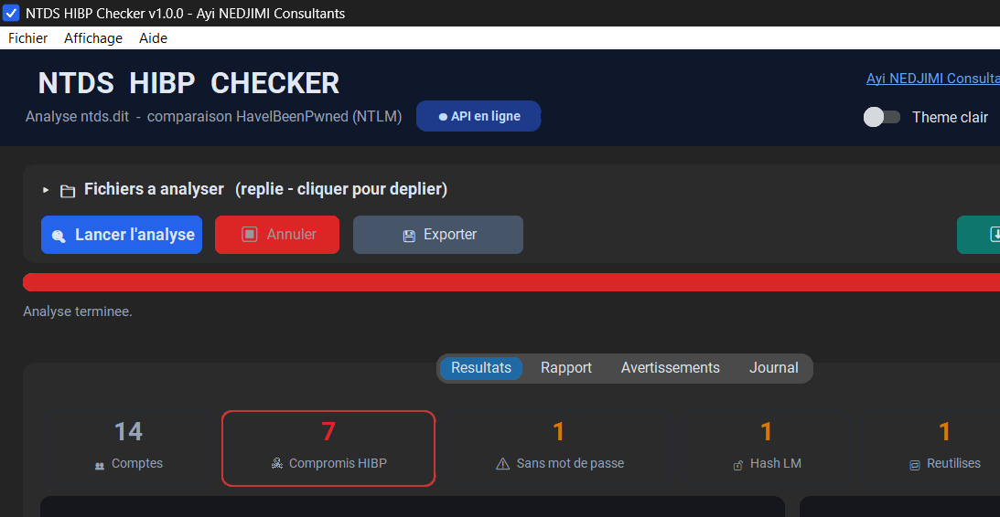
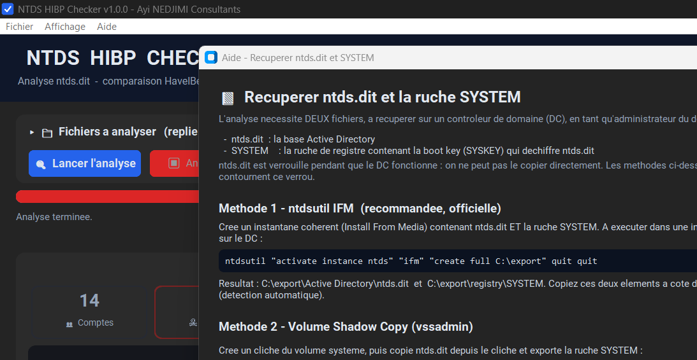
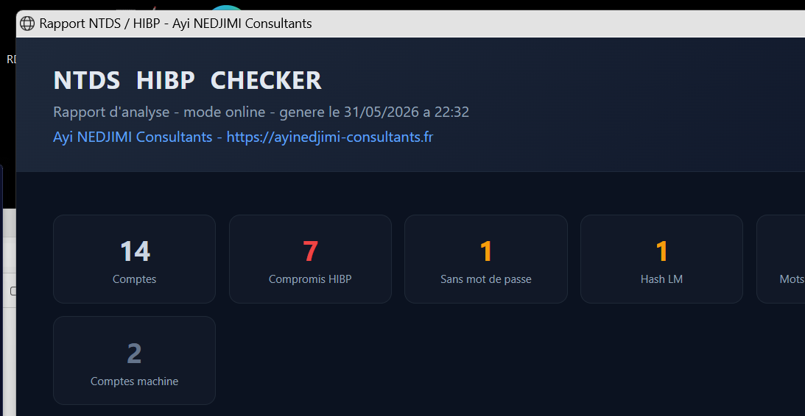
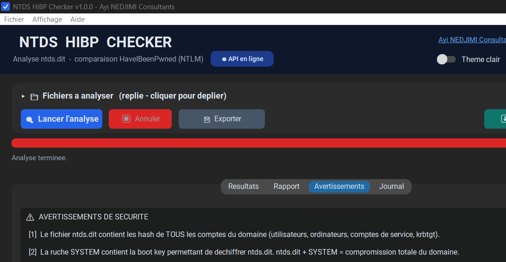

<div align="center">

# 🛡️ NTDS HIBP Checker

**Audit de mots de passe Active Directory — comparez les hash NT de votre `ntds.dit` à la base HaveIBeenPwned (NTLM).**
**Active Directory password auditing — compare your `ntds.dit` NT hashes against the HaveIBeenPwned (NTLM) database.**


🇫🇷 [Français](#-français) · 🇬🇧 [English](#-english)



</div>

---

## 🇫🇷 Français

**NTDS HIBP Checker** est une application Windows de bureau, **100 % portable** (un seul `.exe`, toutes les dépendances embarquées), qui extrait les hash NT d'un fichier `ntds.dit` et les confronte à la base **HaveIBeenPwned – Pwned Passwords (NTLM)** pour identifier en quelques minutes les **comptes à mot de passe compromis, vide, faible (LM) ou réutilisé**.

> Conçu pour les pentesters, équipes blue team et auditeurs AD. Aucune installation, aucun hash en clair écrit sur disque.

### ✨ Fonctionnalités

- 🔌 **Deux modes de comparaison**
  - **En ligne (k-anonymity)** : seuls les **5 premiers caractères** de chaque hash sont envoyés à l'API HIBP — le hash complet ne quitte jamais le poste. Requêtes **parallélisées** (anti rate-limiting 429) + **cache persistant** (sqlite) entre analyses.
  - **Local (hors-ligne)** : recherche **dichotomique** (`mmap`) dans le fichier `pwnedpasswords` NTLM — idéal **air-gapped**.
- ⬇️ **Téléchargement intégré** de la base HIBP NTLM complète (agrégation des 1 048 576 plages, fichier trié prêt à l'emploi, avec **ETA** et arrêt fiable).
- 🔎 **Détections** : mots de passe **compromis**, **vides**, hash **LM** obsolètes, **réutilisation** de mots de passe entre comptes.
- 📊 **Tableau de bord** : cartes de stats animées, **jauge de score de risque**, **camembert** des mots de passe partagés (légende interactive), **tableau triable/filtrable** (double-clic = détails du compte).
- 📤 **Exports** : **HTML** (mise en page soignée + camembert SVG), **JSON**, **CSV**, TXT.
- 🗑️ **Suppression sécurisée** intégrée des fichiers sensibles via **SDelete** (7 passes).
- 🧭 **Découverte automatique** des fichiers dans le dossier courant + **glisser-déposer**.
- ❔ **Aide intégrée** : toutes les méthodes pour récupérer `ntds.dit` + `SYSTEM` (ntdsutil IFM, VSS, diskshadow…).
- 🎨 GUI moderne (thème clair/sombre, raccourcis, splash, micro-animations).

### 🖼️ Captures d'écran

| Tableau de bord | Aide — récupérer ntds.dit |
|---|---|
|  |  |

| Rapport HTML exporté | Avertissements de sécurité |
|---|---|
|  |  |

### 🚀 Installation depuis GitHub

Prérequis : **Windows**, **Python 3.10+**.

```powershell
git clone https://github.com/ayinedjimi/ntds-hibp-checker.git
cd ntds-hibp-checker
.\build.ps1          # cree le venv, installe les deps, genere l'exe portable
```

➡️ Résultat : **`dist\NTDS-HIBP-Checker.exe`** (exe unique, ~30 Mo, tout embarqué).

*Mode développement :* `pip install -r requirements.txt` puis `python app.py`.

### 📋 Utilisation

1. Placez `NTDS-HIBP-Checker.exe` dans le dossier contenant `ntds.dit` et la ruche `SYSTEM` (détectés automatiquement).
2. Choisissez la source HIBP (API en ligne ou fichier local).
3. **Lancer l'analyse** → consultez le tableau de bord, exportez le rapport.
4. Onglet **Avertissements** → **supprimez** `ntds.dit` et `SYSTEM` avec SDelete.

### 🔑 Récupérer `ntds.dit` et `SYSTEM`

Sur un contrôleur de domaine, en administrateur (méthode recommandée — IFM) :

```cmd
ntdsutil "activate instance ntds" "ifm" "create full C:\export" quit quit
```

→ produit `C:\export\Active Directory\ntds.dit` et `C:\export\registry\SYSTEM`.
Le bouton **❔ Aide** de l'application détaille aussi VSS, diskshadow et les snapshots.

### 🔒 Sécurité

- `ntds.dit` + `SYSTEM` = **compromission totale du domaine**. Opérez sur un poste **dédié et isolé**.
- L'application ne stocke **aucun hash en clair** sur disque (traitement en mémoire ; le cache HIBP ne contient que les réponses **publiques** de l'API).
- **Supprimez** les fichiers avec SDelete après l'analyse, et réinitialisez les mots de passe compromis (+ `krbtgt` deux fois) en cas d'exposition.
- ⚠️ À utiliser uniquement sur des systèmes dont vous êtes propriétaire ou pour lesquels vous disposez d'une **autorisation explicite**.

---

## 🇬🇧 English

**NTDS HIBP Checker** is a **fully portable** Windows desktop app (single `.exe`, all dependencies bundled) that extracts NT hashes from an Active Directory `ntds.dit` file and checks them against the **HaveIBeenPwned – Pwned Passwords (NTLM)** database to find **compromised, blank, weak (LM) or reused** account passwords in minutes.

> Built for pentesters, blue teams and AD auditors. No installation, no cleartext hashes written to disk.

### ✨ Features

- 🔌 **Two comparison modes**
  - **Online (k-anonymity):** only the **first 5 characters** of each hash are sent to the HIBP API — the full hash never leaves the machine. **Parallelized** requests (429 rate-limit aware) + **persistent cache** (sqlite) across runs.
  - **Local (offline):** **binary search** (`mmap`) over the `pwnedpasswords` NTLM file — ideal for **air-gapped** environments.
- ⬇️ **Built-in downloader** for the full NTLM database (aggregates all 1,048,576 ranges into a ready, hash-sorted file, with **ETA** and reliable cancel).
- 🔎 **Detections:** **pwned**, **blank**, obsolete **LM** hashes, password **reuse** across accounts.
- 📊 **Dashboard:** animated stat cards, **risk score gauge**, **shared-password pie chart** (interactive legend), **sortable/filterable table** (double-click = account details).
- 📤 **Exports:** **HTML** (polished, with SVG pie), **JSON**, **CSV**, TXT.
- 🗑️ Built-in **secure deletion** of sensitive files via **SDelete** (7 passes).
- 🧭 **Auto-discovery** of files in the current folder + **drag & drop**.
- ❔ **In-app help:** every method to obtain `ntds.dit` + `SYSTEM` (ntdsutil IFM, VSS, diskshadow…).
- 🎨 Modern GUI (light/dark theme, shortcuts, splash, micro-animations).

### 🖼️ Screenshots

| Dashboard | Help — obtaining ntds.dit |
|---|---|
|  |  |

| Exported HTML report | Security warnings |
|---|---|
|  |  |

### 🚀 Install from GitHub

Requirements: **Windows**, **Python 3.10+**.

```powershell
git clone https://github.com/ayinedjimi/ntds-hibp-checker.git
cd ntds-hibp-checker
.\build.ps1          # creates the venv, installs deps, builds the portable exe
```

➡️ Output: **`dist\NTDS-HIBP-Checker.exe`** (single ~30 MB self-contained exe).

*Dev mode:* `pip install -r requirements.txt` then `python app.py`.

### 📋 Usage

1. Drop `NTDS-HIBP-Checker.exe` into the folder containing `ntds.dit` and the `SYSTEM` hive (auto-detected).
2. Pick the HIBP source (online API or local file).
3. **Run the analysis** → review the dashboard, export the report.
4. **Warnings** tab → **wipe** `ntds.dit` and `SYSTEM` with SDelete.

### 🔑 Obtaining `ntds.dit` and `SYSTEM`

On a Domain Controller, as administrator (recommended — IFM):

```cmd
ntdsutil "activate instance ntds" "ifm" "create full C:\export" quit quit
```

→ produces `C:\export\Active Directory\ntds.dit` and `C:\export\registry\SYSTEM`.
The app's **❔ Help** button also documents VSS, diskshadow and snapshots.

### 🔒 Security

- `ntds.dit` + `SYSTEM` = **full domain compromise**. Work on a **dedicated, isolated** host.
- The app writes **no cleartext hashes** to disk (in-memory processing; the HIBP cache only stores **public** API responses).
- **Wipe** the files with SDelete after analysis, and reset compromised passwords (+ `krbtgt` twice) if exposed.
- ⚠️ Use only on systems you own or are **explicitly authorized** to test.

---

<div align="center">

### 👤 Auteur / Author

**Ayi NEDJIMI Consultants** — [ayinedjimi-consultants.fr](https://ayinedjimi-consultants.fr)

Licence **MIT** · *For authorized security testing & auditing only.*

</div>
